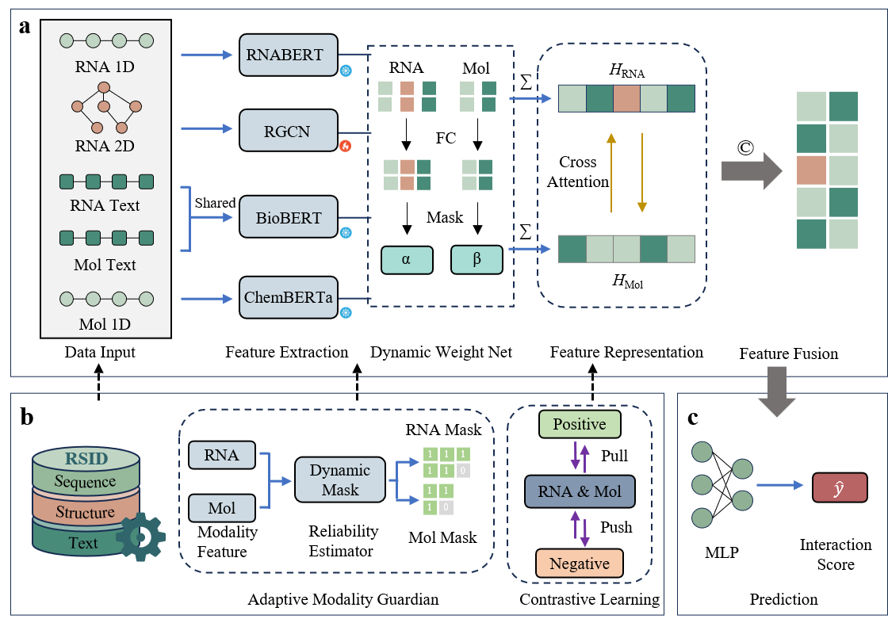

# SemNet

This repository provides the PyTorch implementation of the baseline model (SemNet) described in the paper: "RSID: A Highly Traceable and Multimodally Annotated Database for RNA–Small Molecule Interactions."SemNet is a multimodal deep learning model for RNA–small molecule interaction prediction, which integrates sequence, structural, and semantic representations of both modalities.




# Requirements

* Python >= 3.11
* PyTorch >= 1.0
* RDkit >= 2024.09
* scikit-learn >=1.5

You can install the dependencies via:

```
pip install -r requirements.txt
```

or using the optional conda environment:

```
conda env create -f environment.yml
conda activate SemNet
```

# Download of pre-trained model

```
Download the following pretrained models and place them in the `pretrained_models/` directory:
- ChemBERTa-77M-MTR: https://huggingface.co/DeepChem/ChemBERTa-77M-MTR
- BioBERT: https://huggingface.co/dmis-lab/biobert-base-cased-v1.2
- RNABERT: https://huggingface.co/yangheng/rnabert
```


# Usage

**Training**

Training the model by running

```
python training.py
```

Input:

* Semantic and structural representations of RNA sequences ( .xlsx  files)
* Semantic textual information of small-molecule SMILES strings (.xlsx  files)
* RNA-Small molecule binary interaction labels (0/1) (.xlsx  files)

Output:

* Trained model weights (.pt files)

**Prediction**

Predictions from the models can be generated by running

```
python predict.py
```

Input:

- Semantic and structural representations of RNA sequences
- Semantic textual information of small-molecule SMILES strings


Output:

- Predicted interaction labels (0 = no binding, 1 = binding)
